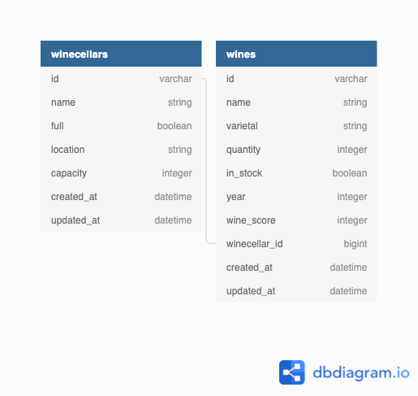

# Relational Rails:  wine_cellar
## Author: John Hennerich  Github: https://github.com/jhennerich

* Ruby version: 2.7.4
* Rails version: 5.2.7

## Included gems:
- gem 'rspec-rails'
- gem 'capybara'
- gem 'launchy'
- gem 'pry'
- gem 'simplecov', require: false, group: :test
- gem 'shoulda-matchers', '~> 3.1'
- gem 'orderly'
- gem 'active_designer'

## Database schema

